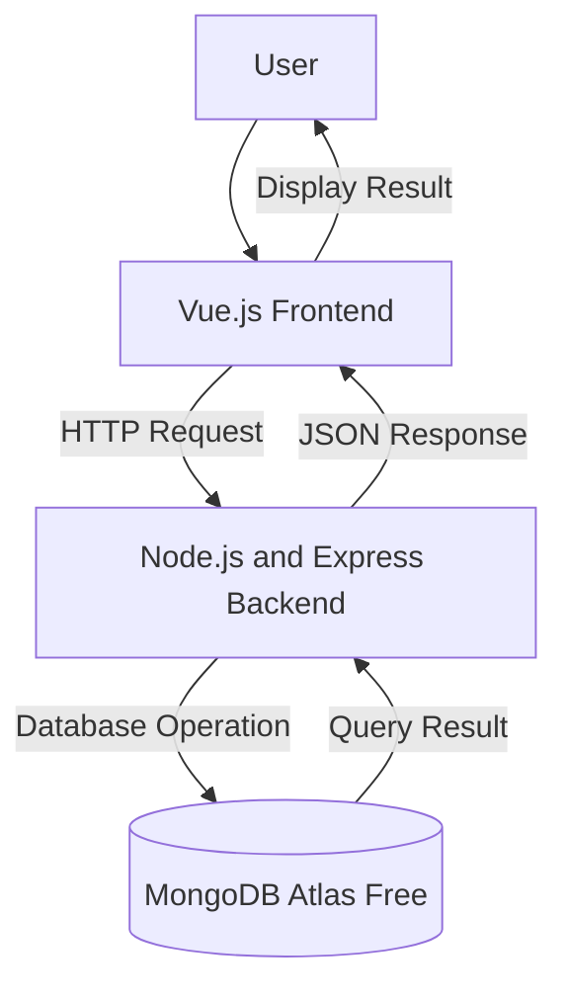

# System Architectural Design
## 1. System Overview
The proposed **Student Information System** is a web-based management platform designed to centralize and automate core academic operations. Its primary purpose is to provide a single, secure digital environment for students, faculty, and administrators to access real-time academic records, manage course registrations, submit grades, and monitor academic progress. By replacing paper-based tasks and fragmented spreadsheets, the system reduces administrative workload, eliminates data redundancy, and streamlines communication across the institution.
## 2. Selected Architectural Pattern
The proposed system will use a three-tier client-server architecture.
The system will be divided into:
1. Presentation layer **Presentation Layer**: Built using Vue.js, this frontend layer handles the user interface and user interaction. It provides dynamic web pages and dashboards for students, faculty, and administrators to view schedules, submit grades, and manage records, communicating with the backend via RESTful APIs.
2. Application layer **Application Layer**: Built using Node.js and Express.js, this backend logic layer manages the core business operations. It handles authentication, validates user inputs, processes course enrollment permissions, calculates GPAs, and enforces system security before interacting with the database.
3. Data layer **Data Layer**: Powered by MongoDB Atlas, this storage layer persists all application data including user credentials, student records, course catalogs, enrollment logs, and grade entries, ensuring data integrity and availability.
This architecture separates the user interface, business logic, and data
management responsibilities.
## 3. Architectural Components
### Presentation Layer
The presentation layer will use Vue.js. It will display information,
collect user input, and send requests to the backend. The presentation layer will use **Vue.js**. It serves as the frontend single-page application (SPA), rendering tailored user interfaces and dashboards for students, faculty, and administrators. It collects user inputs (such as login credentials, course selections, and grade entries), manages visual component states, and transmits RESTful API requests to the application layer.
### Application Layer
The application layer will use Node.js and Express. It will receive
requests, validate data, apply system rules, and communicate with the
database. The application layer will use **Node.js and Express.js**. It functions as the backend API server responsible for receiving requests from the frontend, validating incoming request data, enforcing core business logic (such as checking course prerequisites, validating grade boundaries, and handling authentication), and executing queries against the database layer.
### Data Layer
The data layer will use MongoDB Atlas Free. It will store, retrieve,
update, and delete the system's records. The data layer will use **MongoDB Atlas (Free Tier)**. It serves as the cloud-hosted NoSQL database storing all persistent application records across dedicated collections (such as Users, Courses, Enrollments, and Grades). It receives database commands from the application layer to create, read, update, and delete system records reliably.
## 4. Component Responsibilities
| Component | Technology | Responsibility |
|---|---|---|
| User interface | Vue.js | Displays data and collects user input |
| Application server | Node.js and Express | Processes requests and applies business rules |
| Database | MongoDB Atlas Free | Stores and manages system records |
| Repository | GitHub | Stores documentation and tracks changes |
## 5. System Architecture Diagram

## 6. Data Flow
### Example Process: Create a New Record
1. The user enters information through the Vue.js interface.
2. Vue.js checks the required input fields.
3. The frontend sends an HTTP request to the Express backend.
4. The backend validates and processes the request.
5. The backend sends a database operation to MongoDB.
6. MongoDB stores the new record.
7. MongoDB returns the result to the backend.
8. The backend sends a JSON response to the frontend.
9. The frontend displays a confirmation message.
## 7. Database Plan
### Proposed Database Name
```text
student_academicsystem_db
```
### Primary Collection
```text
records
```
Replace records with the main record of the proposed system.
Examples include books, products, tasks, appointments, events, and assets.
### Proposed Fields
| Field | Type | Description |
|---|---|---|
| _id | ObjectId | Unique record identifier |
| name | String | Name or title of the record |
| description | String | Additional information |
| status | String | Current record status |
| createdAt | Date | Date the record was created |
| updatedAt | Date | Date the record was updated |
Students must replace the sample fields with fields appropriate to their
proposed system.
## 8. Design Justification
Explain why the three-tier architecture is appropriate for the proposed
system. Discuss how separating the frontend, backend, and database can
improve maintainability, security, testing, and future development.
## 9. Architectural Limitations
The current activity focuses only on the proposed architecture. Frontend
code, backend code, database connection, user authentication, and deployment
have not yet been implemented. These components will be developed in Module 7.